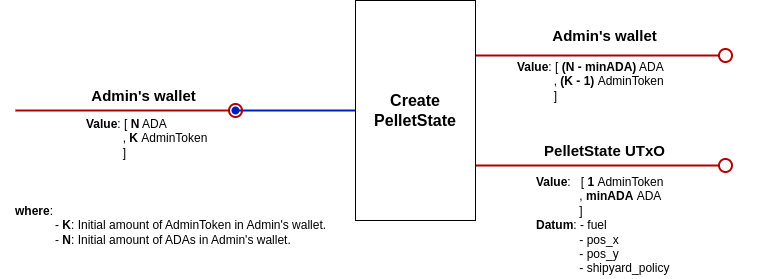
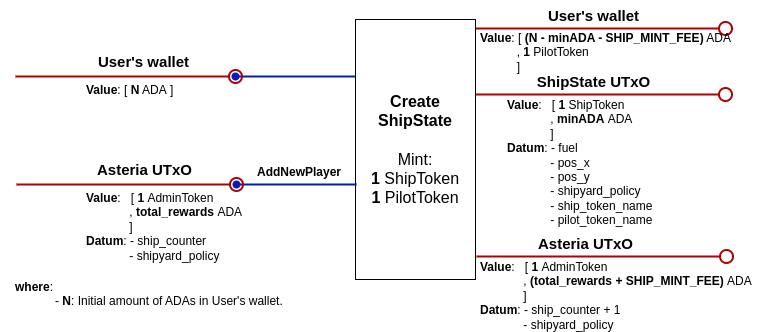
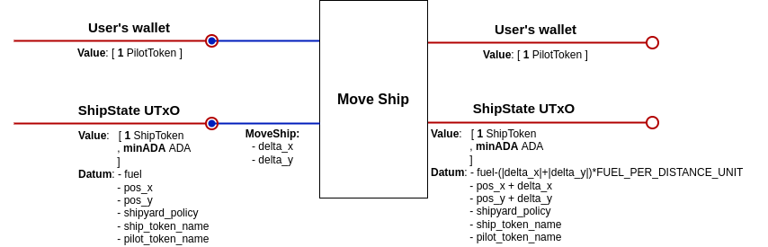
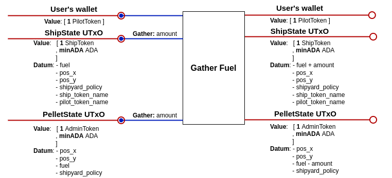
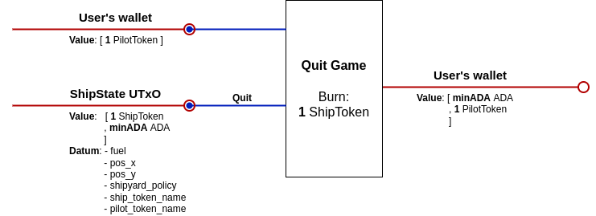

# Asteria dApp Design

## Introduction
This document describes the technical design of the Asteria dApp - the script UTxOs involved, the operations that take place both during the game and in the setup phase, and the necessary validators and minting policies.

There will be a single script UTxO for the `Pot`, several `PelletState` UTxOs and a `ShipState` UTxO for every user. The `Pot` UTxO locks the ada amount paid by each user when creating a ship, and it's position on the board is always assumed to be (0,0). Both `PelletState` and `ShipState` UTxOs have their positions specified in the datum. In order to identify valid game UTxOs, the admin will deposit a special token (the "admin token") in the `PelletState` and `Pot` UTxOs when creating them. This token is also used for parameterizing the pot and fuel validators, so we could have different "versions" of the game, each one with a different admin token.

Each ship will be identified by a `ShipToken`, with a fixed policy id but a token name of their own. This is the token that is minted by the _Ship minting policy_, described in the validators section.

## UTxOs specification

### ShipState UTxO:

>#### Address
>* Parameterized on admin token, `Pot` validator address and `PelletState` validator address.
>
>#### Datum
>* pos_x: **Int**
>* pos_y: **Int**
>* fuel: **Int**
>* pilot_token: **(PolicyId, AssetName)**
>* ship_token_policy: **PolicyId**
>
>#### Value
>* minAda
>* `ShipToken`

### PelletState UTxO:

>#### Address
>* Parameterized on the admin token.
>
>#### Datum
>* pos_x: **Int**
>* pos_y: **Int**
>* fuel: **Int**
>* ship_token_policy: **PolicyId**
>
>#### Value
>* minAda
>* admin token

### Pot UTxO:

>#### Address
>* Parameterized on the admin token.
>
>#### Datum
>* ship_token_policy: **PolicyId**
>
>#### Value
>* minAda
>* reward amount.
>* admin token
>
>Note: the reward amount is updated during the course of the game, whenever a new user joins or reaches the pot.

## Transactions

### Create Pot UTxO:
This transaction creates the unique `Pot` UTxO locking min ada and an admin token. It stores in the datum the ship token policy id for being able to reference it in the validator.

### Create a PelletState UTxO:
Creates one `PelletState` UTxO locking min ada and an admin token, setting in the datum the `pos_x` and `pos_y` coordinates where the pellet will be located on the grid and the `fuel` value equal to some initial value.

### Create a ShipState UTxO:
Creates a `ShipState` UTxO locking min ada and a ship token (minted in this tx), specifying in the datum the initial `pos_x` and `pos_y` coordinates of the ship, and setting `fuel` to an initial amount. Also adds to the `Pot` UTxO value the inscription fee paid by the user.

### Move a Ship:
Updates the `pos_x`, `pos_y` and `fuel` datum fields of the `ShipState` UTxO by adding the `delta_x` and `delta_y` values specified in the redeemer, and subtracting the fuel amount needed for the displacement.

### Gather Fuel:
Updates the `fuel` datum field of both the `ShipState` and `PelletState` UTxOs, adding the `amount` (specified in the redeemer) from the first and subtracting it from the latter.

### Collect Rewards:
Subtracts from the `Pot` UTxO 50% of the ada value, and pays that amount to the owner of the ship that reached the pot, together with the min ada locked in the `ShipState` UTxO. The ship token is burnt.

### Quit Game:
Pays the min ada locked in the `ShipState` UTxO back to the ship owner and burns the ship token.

## Validators & Minting Policies

### Pot validator:
* Params: admin token.

#### *AddNewPlayer Redeemer*
* `Pot` output value equals input value plus the inscription fee.
* adminToken is in the input.
* datum doesn't change.

#### *Collect Redeemer (includes address of the player that reached the pot)*
* ship token is present in some input.
* `Pot` output value has at most 50% adas less than input value.

### PelletState validator:
* Params: admin token.

#### *Gather Redeemer (includes gathering amount)*
* ship token is present in some input.
* the amount specified is not greater than the fuel available in the pellet.
* the amount specified is subtracted from the output `PelletState` fuel datum field, and the other fields remain unchanged.

### ShipState validator:
* Params: admin token, `Pot` validator address and `PelletState` validator address.

#### *MoveShip Redeemer (includes delta_x and delta_y displacements)*
* ship token is present.
* there is a single `ShipState` input.
* there is a single `ShipState` output.
* the `PilotToken` is present in an input.
* the `ShipState` input has enough fuel to move the desired delta.
* the `ShipState` output value doesn't change.
* the pilot_token datum field is not changed.
* the x and y output datum values are updated as the previous ones (input values) plus the corresponding deltas.
* the output fuel datum field equals the input fuel minus the fuel required for the displacement.
* the distance advanced doesn't exceed the `MAX_SHIP_MOVEMENT_PER_TX`.
* the tx is signed by the ship owner.

#### *Gather Redeemer (includes gathering amount)*
* there is a single `ShipState` input.
* there is a single `ShipState` output.
* there is a `PelletState` input with the same x and y datum coordinates as the `ShipState` UTxO.
* the amount specified plus the fuel before charging does not exceed the ship's fuel capacity.
* the amount specified is added to the output `ShipState` fuel datum field, and the other fields remain unchanged.
* the `ShipState` output value is the same as the input.

#### *Collect Redeemer*
* there is a single `ShipState` input.
* pilot token is present.
* `ShipState` position is (0,0).
* `Pot` UTxO is input.
* ship token is burnt.

#### *Quit Redeemer*
* there is a single `ShipState` input.
* the `PilotToken` is present in an input.
* no `ShipState` output.

### Ship minting policy:
* Params: `ShipState` validator address.

#### MINT:
* a single token is minted.
* there is a single `ShipState` output.
* the `ShipState` output datum has x and y coordinates such that distance from (0,0) is above the minimum distance.
* the `ShipState` output datum has the `ship_token_policy` set as the policy id of the minted token.
* the `ShipState` fuel datum field equals some initial value.
* the minted token is paid to the `ShipState` validator address.

#### BURN:
* there is a `ShipState` input.
* the `ShipState` input is at coordinates (0,0).
* only one token is burnt.
