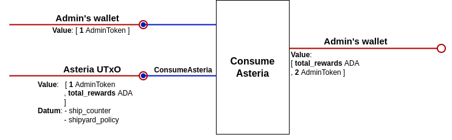

# Asteria dApp Design

## Introduction

This document describes the technical design of the Asteria dApp - the script UTxOs involved, the operations that take place both during the game and in the setup phase, and the necessary validators and minting policies.

There will be a single `AsteriaUtxo`, several `PelletState` UTxOs and a `ShipState` UTxO for every user. The `AsteriaUtxo` locks the ada amount paid by each user when creating a ship, and it's position on the board is always assumed to be (0,0). Both `PelletState` and `ShipState` UTxOs have their positions specified in the datum. In order to identify valid game UTxOs, the admin will deposit a special token (the `AdminToken`) in the `PelletState` UTxOs and the `AsteriaUtxo` when creating them. This token is also used for parameterizing the Asteria and pellet validators, so we could have different "versions" of the game, each one with a different `AdminToken`.

Each ship will be identified by a `ShipToken`, with a fixed policy id but a token name of their own. This is the token that is minted by the `ShipyardPolicy`, described in the validators section.

## Constants Glossary

- `MAX_SPEED`: maximum speed allowed for ship's movement.
- `INITIAL_FUEL`: ship's fuel upon creation.
- `MAX_SHIP_FUEL`: ship's fuel capacity.
- `FUEL_PER_STEP`: fuel spent per distance unit.
- `MAX_ASTERIA_MINING`: maximum percentage that can be obtained from the rewards accumulated when a ship reaches Asteria. Must be an integer between 0 and 100.
- `MIN_ASTERIA_DISTANCE`: ship's minimum distance to Asteria upon creation.
- `SHIP_MINT_LOVELACE_FEE`: amount of Lovelace that users have to pay to create a ship.

## UTxOs specification

### ShipState UTxO

>#### Address
>
>- Parameterized on `AdminToken`, Asteria validator address, pellet validator address, MAX_SPEED, MAX_SHIP_FUEL, FUEL_PER_STEP, INITIAL_FUEL and MIN_ASTERIA_DISTANCE. The validator corresponding to this address is in `spacetime.ak`.
>
>#### Datum
>
>- fuel: **Int**
>- pos_x: **Int**
>- pos_y: **Int**
>- ship_token_name: **AssetName**
>- pilot_token_name: **AssetName**
>- last_move_latest_time: **PosixTime**
>
>#### Value
>
>- minADA
>- `ShipToken`

### PelletState UTxO

>#### Address
>
>- Parameterized on the `AdminToken`.
>
>#### Datum
>
>- fuel: **Int**
>- pos_x: **Int**
>- pos_y: **Int**
>- shipyard_policy: **PolicyId**
>
>#### Value
>
>- minADA
>- `AdminToken`
>- prizeTokens

### Asteria Utxo:

>#### Address
>
>- Parameterized on the `AdminToken`, SHIP_MINT_LOVELACE_FEE, MAX_ASTERIA_MINING.
>
>#### Datum
>
>- ship_counter: **Int**
>- shipyard_policy: **PolicyId**
>
>#### Value
>
>- minADA + total_rewards
>- `AdminToken`
>
>Note: the reward amount is updated during the course of the game, whenever a new user joins or reaches Asteria.

## Transactions

### Create Asteria UTxO

This transaction creates the unique `AsteriaUtxo` locking min ada and an `AdminToken`. It stores in the datum the `ShipToken` policy id for being able to reference it in the validator.

### Create a PelletState UTxO

Creates one `PelletState` UTxO locking min ada, an `AdminToken` and some extra tokens ("prize tokens") that ship owners can retrieve besides gathering fuel when they reach the pellet. Also sets the `pos_x` and `pos_y` datum coordinates where the pellet will be located on the grid and the `fuel` value equal to some initial value.

### Create a ShipState UTxO

Creates a `ShipState` UTxO locking min ada and a `ShipToken` (minted in this tx), specifying in the datum the initial `pos_x` and `pos_y` coordinates of the ship, its initial `fuel`, the ship and pilot token names and the `last_move_latest_time` as the upper bound of the transaction's validity range (posix time). Also adds to the `AsteriaUTxO` value the `SHIP_MINT_LOVELACE_FEE` paid by the user.

### Move a Ship

Updates the `pos_x`, `pos_y` and `fuel` datum fields of the `ShipState` UTxO by adding the `delta_x` and `delta_y` values specified in the redeemer, and subtracting the fuel amount needed for the displacement. Also updates the `last_move_latest_time` field with the transaction's validity range latest posix time.

### Gather Fuel

Updates the `fuel` datum field of both the `ShipState` and `PelletState` UTxOs, adding the `amount` (specified in the redeemer) from the first and subtracting it from the latter. Also allows the ship owner to get any amount of the prize tokens held in the pellet.

### Mine Asteria UTxO

Subtracts from the `AsteriaUTxO` at most `MAX_ASTERIA_MINING`% of the ada value, and pays that amount to the owner of the ship that reached Asteria, together with the min ada locked in the `ShipState` UTxO. The `ShipToken` is burnt.

### Quit Game

Pays the min ada locked in the `ShipState` UTxO back to the ship owner and burns the `ShipToken`.

### Consume Asteria UTxO

Pays the admin the value locked in the `AsteriaUtxo`.

### Consume PelletState UTxO

Pays the admin the value locked in the `PelletState` UTxO.

## Validators & Minting Policies

### Asteria validator

- Params: `AdminToken`, `SHIP_MINT_LOVELACE_FEE` and `MAX_ASTERIA_MINING`.

#### *AddNewShip Redeemer*

- `AsteriaUTxO` output value equals input value plus the `SHIP_MINT_FEE`.
- `AdminToken` is in the input.
- datum `ship_counter` field is incremented by 1.

#### *Mine Redeemer*

- `ShipToken` is present in some input.
- `AsteriaUTxO` output value has at most `MAX_ASTERIA_MINING`% adas less than input value.
- datum doesn't change.

#### *ConsumeAsteria Redeemer*

- `AdminToken` is present in some wallet input.

### Pellet validator

- Params: `AdminToken`.

#### *Provide Redeemer (includes gathering amount)*

- `ShipToken` is present in some input.
- the amount specified is not greater than the fuel available in the pellet.
- the amount specified is subtracted from the output `PelletState` fuel datum field, and the other fields remain unchanged.
- The admin token is present in the input `PelletState`.
- The admin token is present in the output `PelletState`.

#### *ConsumePellet Redeemer*

- `AdminToken` is present in some wallet input.

## Ship Multivalidator

Includes the Spacetime validator and the Shipyard policy.

### SpaceTime validator

- Params: `AdminToken`, Asteria validator address, pellet validator address, MAX_SPEED, MAX_SHIP_FUEL, FUEL_PER_STEP, INITIAL_FUEL and MIN_ASTERIA_DISTANCE.

#### *MoveShip Redeemer (includes delta_x and delta_y displacements)*

- the `ShipState` input is the only script input.
- there is a single `ShipState` output.
- the `PilotToken` is present in an input.
- the `ShipState` output value only has the `ShipToken` and some amount of ada.
- the `ShipState` input has enough fuel to move the desired delta.
- the distance advanced divided by the tx validity range (posix time) doesn't exceed the maximum speed.
- the `ShipState` input `last_move_latest_time` datum field is not greater than the earliest posix time of the tx validity range.
- the output `fuel` datum field equals the input fuel minus the fuel required for the displacement.
- the `pos_X` and `pos_y` output datum values are updated as the previous ones (input values) plus the corresponding deltas.
- the output `last_move_latest_time` datum field is set as the latest posix time of the tx validity range.
- the pilot_token datum field is not changed.

#### *GatherFuel Redeemer (includes gathering amount)*

- there are two script inputs: `ShipState` and `PelletState`.
- there is a single `ShipState` output.
- `PilotToken` is present.
- the `ShipState` output value only has the `ShipToken` and some amount of ada.
- the `PelletState` input has the same x and y datum coordinates as the `ShipState` UTxO.
- the amount specified plus the fuel before charging does not exceed `MAX_SHIP_FUEL` capacity.
- the amount specified is added to the output `ShipState` fuel datum field, and the other fields remain unchanged.
- `ShipState` datum's `last_move_latest_time` is not greater than the earliest posix time of the tx validity range.

#### *MineAsteria Redeemer*

- there are two script inputs: `ShipState` and `AsteriaUTxO`.
- `PilotToken` is present.
- `ShipToken` is burnt.
- `ShipState` position is (0,0).
- `ShipState` datum's `last_move_latest_time` is not greater than the earliest posix time of the tx validity range.

#### *Quit Redeemer*

- the `ShipState` input is the only script input.
- the `PilotToken` is present in an input.
- `ShipToken` is burnt.

### Shipyard policy

- Params: same as SpaceTime validator.

#### *MintShip Redeemer*

- `AsteriaUTxO` is input.
- exactly two tokens are minted.
- the name of one token is the `ship_counter` of the `AsteriaUTxO` datum appended to the string `SHIP`. We refer to this token as the `ShipToken`.
- the name of one token is the `ship_counter` of the `AsteriaUTxO` datum appended to the string `PILOT`. We refer to this token as the `PilotToken`
- there is a single `ShipState` output.
- the `ShipState` fuel datum field equals INITIAL_FUEL.
- the `ShipState` output datum has x and y coordinates such that distance from (0,0) is above MIN_ASTERIA_DISTANCE.
- the `ShipState` output datum has the `ship_token_name` set as the name of the `ShipToken`.
- the `ShipState` output datum has the `pilot_token_name` set as the name of the `PilotToken`.
- the `ShipState` output datum has the `last_move_latest_time` set as the latest posix time of the tx validity range.
- the `ShipState` output value only has the `ShipToken` and some amount of ada.

#### *BurnShip Redeemer*

- only one token is burnt.
